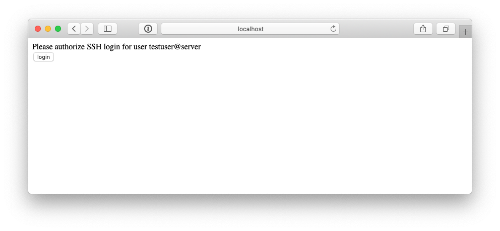
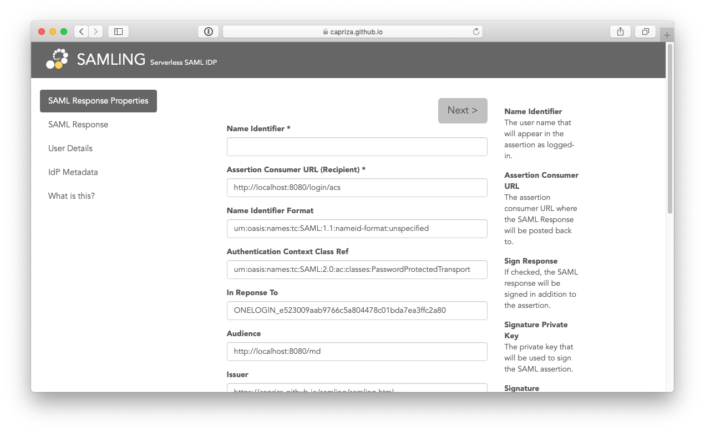
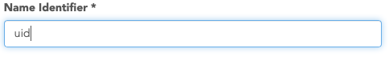
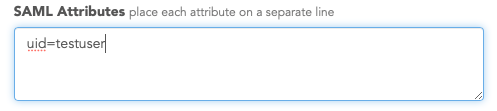
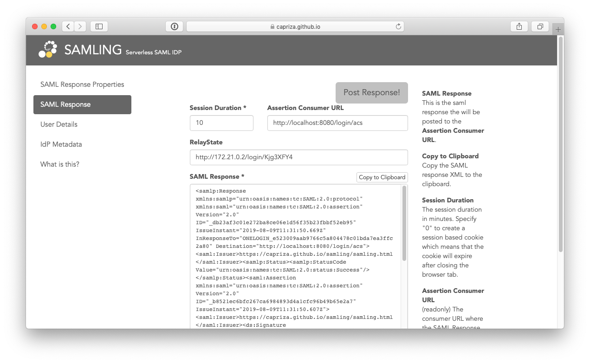
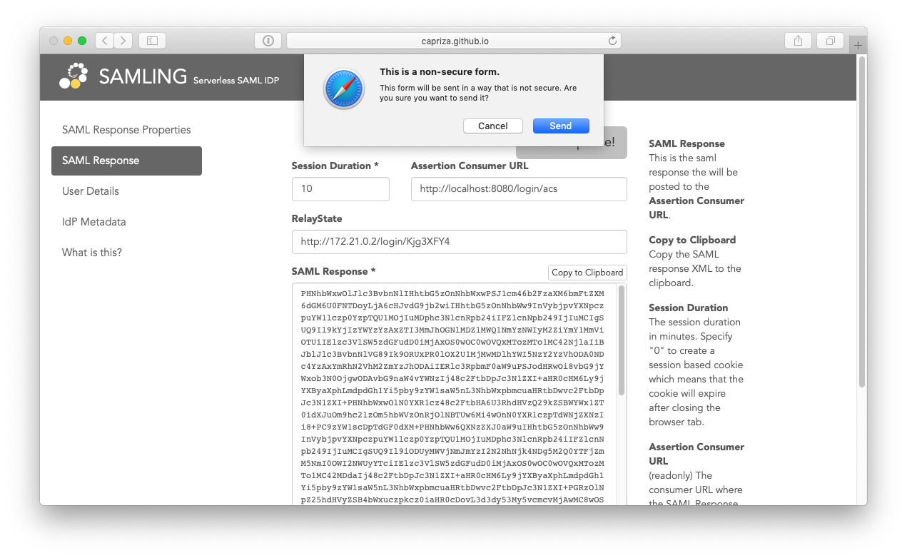
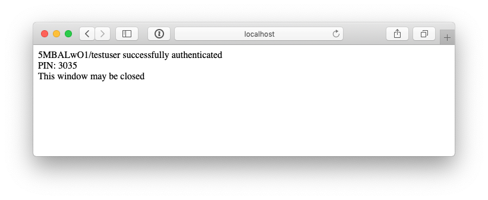
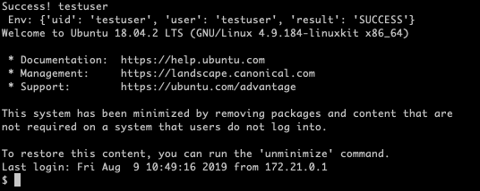

# Howto run this docker example ?

You need to have Docker and Docker-Compose installed on your system.

[Install docker](https://docs.docker.com/install/)

[Install docker compose](https://docs.docker.com/compose/install/)

Now build the example:

```
docker-compose build
```

This takes a while, when finished, run:

```
docker-compose run -d
```

This will bring up 2 containers:

1. web container listening op port 8080
2. ssh container listening on port 2222

From you laptop you can now try to login on the SSH container as user ***testuser***

```
ssh -p 2222 testuser@localhost
```

(When this is the first time, you have to accept the server key of this ssh container.)

The ssh server will respond logon request with message like this:

```
Visit http://localhost:8080/login/iAw6BMNg to login and enter PIN
or press <enter> to skip websso:
```

copy the link and paste it in your browser. Requesting that page results in following response:

<center>

Press the **login** button

You will be redirected to the IDP (Identity Provider). Fot this demonstration, the IDP will be an existing external SAML playground. (this is configured in ***etc/websso_daemon.json***)

<center>

for this demonstration, fill in following fields:

<center>

and

<center>

Now press button **Next >** on top of the page

You will be presented with the SAML response generated by this IDP

<center>

You can examine this response.

Now press **Post Response!**, this will make the saml response available back to your local browser window...

You will get a warning first, because we are using HTTP instead of HTTPS during this demonstration, for now this is OK off course.

<center>

press **send**

You will be redirected back to your localhost browser window, and following will be presented:

<center>

Now enter that pincode on you ***SSH*** screen, and you have entered the server as a valid authenticated user...

<center>


